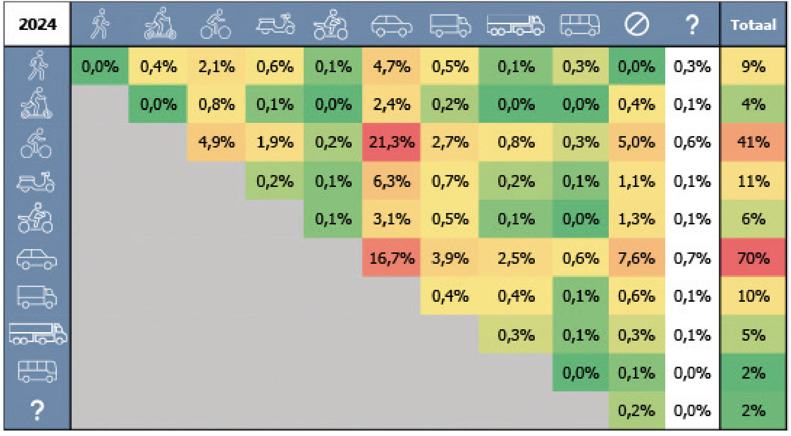
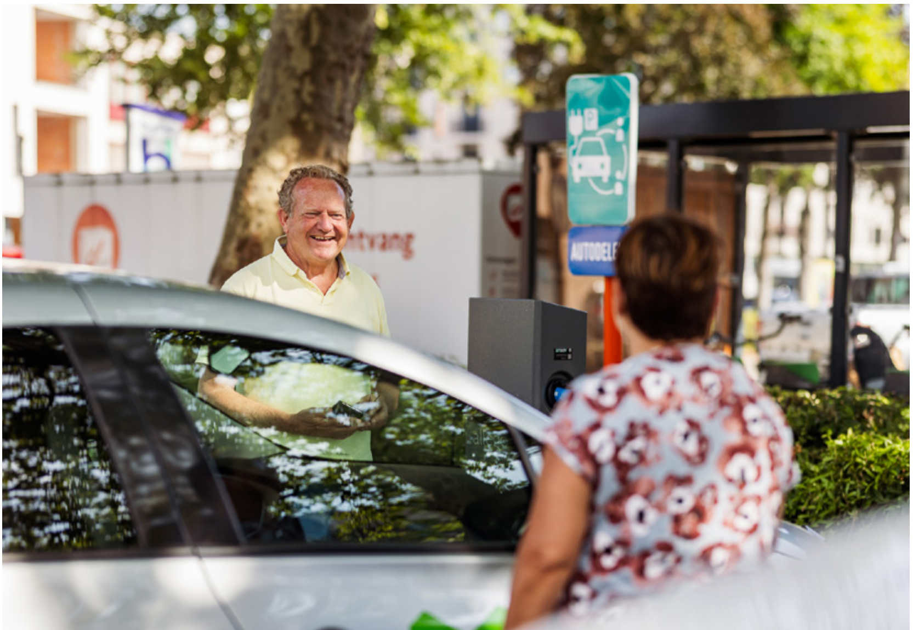
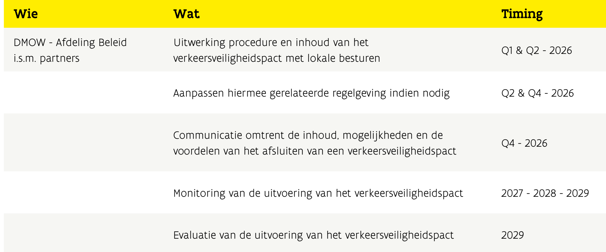

[Non-Text]

Vlaanderen

verbeelding werkt

**Image understanding:** A man and a child are riding bicycles on a paved path in a residential area with parked cars and buildings. A yellow and white logo for "Vlaanderen" is positioned in the upper right corner of the image.

# Verkeersveiligheidsplan

# Vlaanderen 2026-2030

Voor een Verkeersveiliger Vlaanderen

© Vlaanderen Verkeersveiligheid - 2016. Verslagen

Vlaamse Regering

www.vlaanderen.be/verkeersveiligheidsplan

<!-- Page break -->

## WIE IS BETROKKEN IN HET ONGEVAL? - WIJZIGINGEN IN HET VERPLAATSINGSGEDRAG ZORGEN VOOR WIJZIGINGEN IN BOTSINGSCONFIGURATIES

De modal split evolueert richting duurzamere modi. Met andere woorden: er wordt meer gewandeld en gefletst. Het aandeel van de auto dadale van circa 65% van de verplaatsingen in 2015–2019 naar 60% in 2024 (Departement Mobiliteit en Openbare Werken, 2020; 2025).

Deze veranderingen in het verplaatsingsgedrag gaan ook gepaard met een verschuiving in botsingsconfiguraties.

In onderstaande tabellen wordt een overzicht gegeven van de tegenpartij waarmee een weggebruiker in aanrijding komt. Dit wordt weergegeven voor zowel de letselongevallen als de verkeersdoden, voor het meest recente jaar 2024. Op deze manier wordt inzichtelijker gemaakt welke partijen betrokken zijn in een ongeval.

In 2024 is de auto nog steeds de meest frequente botsingspartner naandeel van 70% bij de letselongevallen), maar het aandeel van de fiets als botsingspartner neemt wel toe Lox 10 jaar geleden (gestegen naar 41%). Het aandeel van personenwagens als botsingspartner daalde in de periode 2015-2024 met ongeveer 10 procentpunten. Daarnaast nam het aantal ongevallen tussen fietsers onderling en ongevallen tussen auto's enerzijds en kwetsbare weggebruikers – voetgangers, fietsers en bromfietsers – anderzijds duidelijk toe. Het aandeel eenzijdige fietsongevallen, waarbij geen andere weggebruiker betrokken is, vertoont eveneens een stijgende trend.

**Image understanding:** This table displays a collision matrix for the year 2024, showing the relative percentage of collisions between different types of road users, such as pedestrians, cyclists, and various motor vehicles. The data is organized in a triangular grid where the rows and columns represent different transport modes, with the "Totaal" column on the right showing the overall percentage of collisions for each mode.

*Figuur 10: Botsingsmatrix met letsolengevallen naar conflicttype, relatief aandeel, 2024*

Bron: Statbel (Algemeine Directie Statistiek – Statistics Belgium)

<!-- Page break -->

Uit de ESRA3-bevraging blijkt dat 10,6% van de Vlaamse respondenten aangeeft in de afgelopen 30 dagen als bestuurder minstens één keer zonder veiligheidsgordel te hebben gereden. Dit ligt onder het Europese gemiddelde van 15%. Voor passagiers voorin ligt het aandeel Vlamingen dat aangeeft minstens één keer zonder gordel te rijden op 13,6%, wat ongeveer overeenkomt met het Europese gemiddelde van 14,7%. Voor passagiers achterin gaf 23,8% van de respondenten aan minstens één keer zonder gordel te hebben gezeten, een percentage dat lager ligt dan het EU22-gemiddelde van 32%.

De meest recente gegevens over het gebruik van kinderzittjes zijn afkomstig uit de ESRAA-bevraging. Hieruit blijkt dat 19,1% van de Vlaamse respondenten beweert in de afgelopen 30 dagen minstens één keer een kind kleiner dan 1,35 meter vervoerde zonder gebruik van een aangepast kinderzitje. Dit ligt in lijn met het Europese gemiddelde van 18,3%.

## Door de vergrijzing van de bevolking zal ook het aandeel van verkeersongevallen met ouderen toenemen

De dubbele vergrijzing – de sterke toename van 60- en 80-plussers – heeft belangrijke implicaties voor de verkeersveiligheid. Het aandeel verkeersdoden in de leeftijdsgroep 60-79 jaar steeg van 21% in 2015 naar 29% in 2024, wat samenhangt met zowel hun toenemende aanwezigheid in het verkeer als hun fysieke kwetsbaarheid. Oudere weggebruikers vertonen weliswaar minder risicogedrag, maar zijn vaak kwetsbare weggebruikers die wandelen en fietsen, wat gepaard gaat met een hoger ongevalsrisico. Tegelijk biedt wandelen en fietsen ook gezondheidsvoordelen voor ouderen en kan het bijdragen aan hun algemeen welzijn en zorgen voor sociale inclusie. Daarom is het belangrijk om te werken met de '8 tot 80+ norm'.

**Image understanding:** A man in a light-colored shirt stands behind a car, smiling toward a woman in a patterned shirt who is facing away from the camera. A grey speaker sits on the car's roof between the two people.

*© Departement Mobiliteit en Openbare Werken*

<!-- Page break -->

## Monitoring en opvolging (mogelijke KPI's)

▶ Uitgewerkte procedure voor het afsluiten van een verkeersveiligheidspact met lokale besturen

▶ Lage planlast voor lokale besturen

▶ Aangepaste regelgeving m.b.t. financiële ondersteuningsmiddelen

▶ Inhoudelijke verkeersveiligheidsindicatoren voor het monitoren van de impact die eventueel kunnen worden opgenomen (nog verder uit te werken):

- daling van het aantal letselongevallen op gemeentewegen

- daling van het aantal letselongevallen op het grondgebied (gemeentewegen en gewestwegen)

- daling van het aantal gevaarlijke punten op gemeentewegen

- daling van het aantal gevaarlijke punten op het grondgebied (gemeentewegen en gewestwegen)

• ...

▶ Procesmatig: aantal of percentage instappende steden en gemeenten binnen een bepaalde tijdspanne

## Verantwoordelijkeen

Trekker: afdeling Beleid – team Verkeersveiligheidsbeleid en team Vervoerregio's (departement MOW – Vlaamse overheid)

Betrokken partners: lokale besturen. VVSG, lokale politiezones, andere stakeholders (zoals VSV. ...)

## Impact/bijdrage tot de verkeersveiligheid (inschatting)

Samenwerking tussen het Vlaamse en het lokale beleidsniveau kan ervoor zorgen dat naast op het hoofdwegennet en de gewestwegen ook op de gemeentwegen de Vlaamse verkeersveiligheidsdoelstellingen worden gerealiseerd.

**Image understanding:** A table with three columns titled "Wie" (Who), "Wat" (What), and "Timing" lists a series of tasks related to a traffic safety pact. The tasks include developing procedures, adjusting regulations, communicating benefits, monitoring implementation, and evaluating the pact between 2026 and 2029.

Wie

DMOW - Afdeling Beleid
i.s.m. partners

Wat

Uitwerking procedure en inhoud van het verkeersveiligheidspact met lokale besturen

Aanpassen hiermee gerelateerde regelgeving indien nodig

Communicatie omtrent de inhoud, mogelijkheden en de voordelen van het afsluiten van een verkeersveiligheidspact

Monitoring van de uitvoering van het verkeersveiligheidspact

Evaluatie van de uitvoering van het verkeersveiligheidspact

Timing

<table><tr><td>Q1 &amp; Q2 - 2026</td></tr><tr><td>Q2 &amp; Q4 - 2026</td></tr><tr><td>Q4 - 2026</td></tr><tr><td>2027 - 2028 - 2029</td></tr></table>

2029
